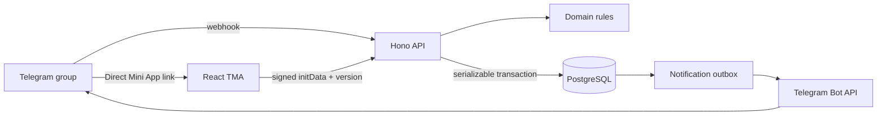

# Architecture

## Repository

```text
apps/
  api/       Hono HTTP API, Telegram webhook, outbox worker, Prisma
  web/       Vite + React Telegram Mini App
packages/
  domain/    rules, catalogs, generator, map geometry, shared DTO schemas
```

The bot is an API module rather than a separate public service. Telegram sends
webhooks to the Hono app and the outbox worker uses the same database and domain
contracts.

## Request flow



## Backend modules

- `auth` — Telegram signature verification and development identity.
- `drafts` — creation, identity claims, regeneration, start, read model, picks.
- `generator` — deterministic constrained generation from the versioned catalog.
- `telegram` — webhook commands, group binding, seat claiming.
- `outbox` — retryable notification delivery.
- `presenters` — converts database records to public DTOs.

Hono context variables carry the authenticated actor and request ID. Routes parse
input with Zod and throw typed HTTP errors. The server uses the Node adapter.

## Database model

- `User` — Telegram identity.
- `Draft` — lifecycle, config, seed, cursor, version, group.
- `DraftPlayer` — named seat, player order, optional Telegram owner.
- `DraftOption` — frozen faction/slice/position snapshot.
- `DraftEvent` — append-only audit history.
- `NotificationOutbox` — Telegram delivery queue.
- `TelegramUpdate` — webhook idempotency.

The flexible `DraftOption.payload` JSON stores versioned catalog snapshots while
the common selection fields remain relational and constrained.

## Frontend state

The TMA is a route-light single-page application with four product states:

- setup;
- lobby/claiming;
- active draft;
- completed map/activity.

Remote server state is authoritative. Local state is limited to unsaved setup
form values, selected option, and transient map pan position. Mutations include
the last observed draft version and invalidate the draft query on success.

## Deployment

- Web: static Vite build served by any HTTPS CDN.
- API/bot: one Node container running Hono and the outbox loop.
- Database: managed PostgreSQL.
- Local: Docker Compose starts PostgreSQL; Vite and Hono run with hot reload.

Production should run migrations as a release step, not on every container boot.
